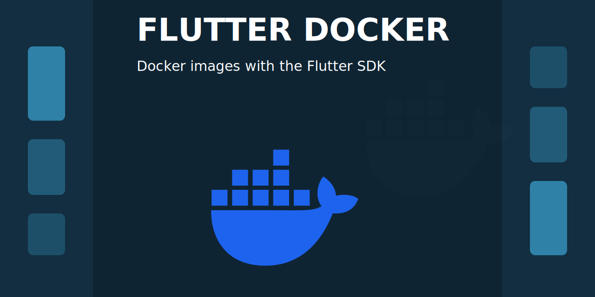

<p align="center">
  
</p>

# Flutter Docker

[](https://github.com/azol/flutter-docker/actions/workflows/ci.yml)
[](https://github.com/azol/flutter-docker/pkgs/container/flutter)
[](LICENSE)

Docker images containing the [Flutter SDK](https://flutter.dev).

Flutter is an open source framework for building beautiful, natively compiled, multi-platform applications from a single codebase.

## How to use this image

```console
docker pull ghcr.io/azol/flutter:web
```

Build a Flutter web application:

```console
docker run --rm -v "$PWD":/app -w /app ghcr.io/azol/flutter:web flutter build web
```

## Tags

| Tag            | Description  |
|----------------|--------------|
| `<version>` | Base image for this Flutter version |
| `<version>-base` | Explicit base image for this Flutter version |
| `<version>-web` | Web-ready image for this Flutter version|
| `base` | Alias of the latest stable base image |
| `latest` | Alias of the latest stable base image |
| `web` | Alias of the latest stable web image |

## License

View [license information](https://github.com/flutter/flutter/blob/master/LICENSE) for the software contained in this image.

This Flutter Docker project is licensed under the [MIT License](LICENSE).
