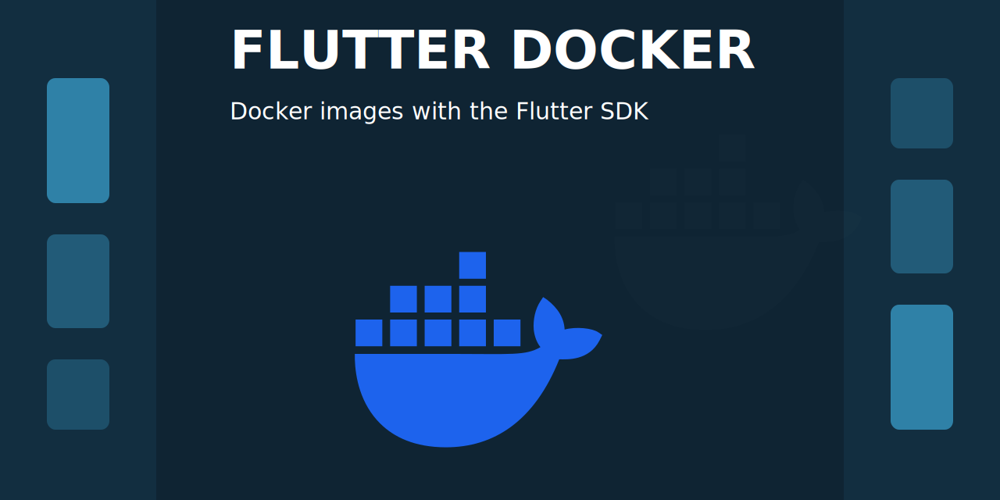

<p align="center">
  
</p>

# Flutter Docker

Docker images containing the [Flutter SDK](https://flutter.dev).

Flutter is an open source framework for building beautiful, natively compiled, multi-platform applications from a single codebase.

[](LICENSE)
[](https://github.com/azol/flutter-docker/tags)
[](https://github.com/azol/flutter-docker/actions/workflows/publish-base.yml)

## How to use this image

```console
docker pull ghcr.io/azol/flutter:latest
```

Build a Flutter web application:

```console
docker run --rm -v "$PWD":/app -w /app ghcr.io/azol/flutter:web flutter build web
```

## Tags

| Tag | Description |
|-----|-------------|
| `<version>-base` | Minimal base image for a specific Flutter version |
| `<version>` | Alias of the base image for that version |
| `base` | Latest stable base image |
| `latest` | Alias of the latest stable version |
| `web` | Alias of the latest base image (web-ready) |

## License

View [license information](https://github.com/flutter/flutter/blob/master/LICENSE) for the software contained in this image.

This Flutter Docker project is licensed under the [MIT License](LICENSE).
